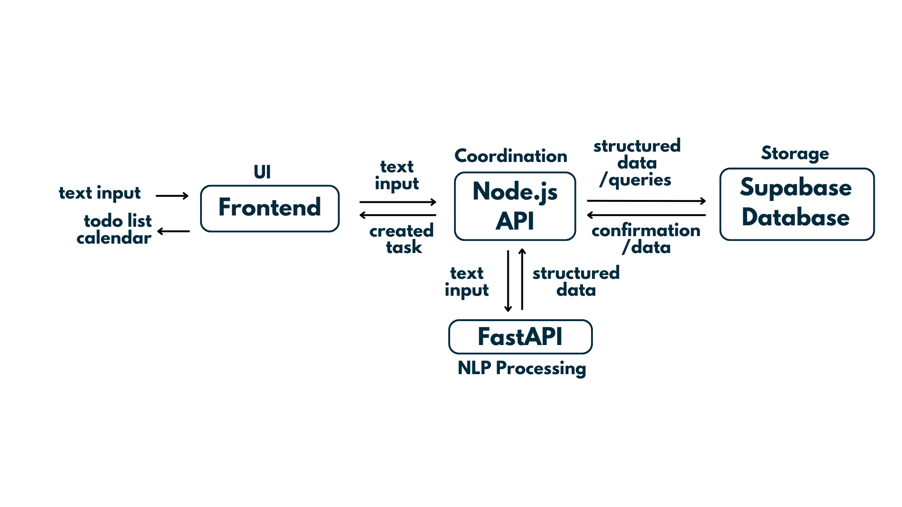

# StudySync

A sophisticated task management application leveraging natural language processing to streamline task organization and event management.

## Overview

StudySync is an innovative solution designed to address the challenges of modern task management through intelligent automation and seamless integration. By combining natural language processing with calendar management, StudySync provides a unified platform for organizing academic and professional commitments.

## Team

- **Anusha Muralidhar** – Database Architecture & Implementation
- **Nhi Dinh** – Backend Architecture, NLP Development, API Integration & Testing
- **Grace Lin** – Frontend Development & Authentication
- **Ruoqi Wang** – Calendar Integration & UI/UX

## Problem Statement

Modern professionals and students face several challenges in task management:

- Distributed deadlines across multiple platforms and systems
- Inefficient tracking of academic and professional commitments
- Lack of centralized scheduling solutions
- Time-consuming manual task management
- Increased stress due to disorganized scheduling

## Solution

StudySync addresses these challenges through:

- Unified task management platform
- Natural language processing for intuitive task creation
- Automated calendar event generation
- Smart deadline reminders and notifications
- Flexible manual editing capabilities
- Secure user account system for persistent scheduling

## Technical Architecture

### Technology Stack

- **Frontend**: React Native with Expo framework
- **Backend**: Node.js REST API
- **Natural Language Processing**: Python FastAPI with spaCy
- **Database & Authentication**: Supabase (PostgreSQL)
- **Calendar Integration**: FullCalendar.js

## Project Structure



```
team-28-project/
├── backend/
│   ├── api/              # Node.js API server (main backend)
│   │   ├── server.cjs
│   │   └── ...           # Other API files
│   ├── nlp/              # Python NLP logic
│   │   ├── nlp.py
│   │   └── ...
│   ├── routers/          # FastAPI routers
│   │   ├── nlp_events.py
│   │   └── ...
│   ├── models/           # Python models
│   ├── services/         # Python services
│   ├── utils/            # Python utilities
│   ├── main.py           # FastAPI app entrypoint
│   ├── test_api_client.py # API test client
│   ├── test_simple_nlp.py # NLP test suite
│   ├── package.json      # Node.js dependencies for backend
│   ├── package-lock.json
│   └── .env              # Backend environment variables (not committed)
├── frontend/
│   ├── src/
│   │   ├── app/
│   │   ├── components/
│   │   ├── api/
│   │   ├── utils/
│   │   └── ...
│   ├── assets/           # Images, fonts, etc.
│   ├── App.js            # Expo entrypoint
│   ├── app.json          # Expo config
│   ├── package.json      # Frontend dependencies
│   ├── package-lock.json
│   └── .env              # Frontend environment variables (not committed)
├── app/                  # Additional application code
├── venv/                 # Python virtual environment
├── .expo/                # Expo configuration
├── README.md
├── requirements.txt      # Root Python dependencies
├── .gitignore
├── input.json           # Test input data
└── output.json          # Test output data
```

## System Requirements

- Node.js (v14 or higher)
- npm (v6 or higher)
- Python 3.8 or higher
- pip package manager
- Expo CLI (`npm install -g expo-cli`)

## Installation

### 1. Repository Setup
```bash
git clone [repository-url]
cd team-28-project
```

### 2. Dependency Installation
```bash
# Backend Dependencies
cd backend
npm install
cd ../frontend
npm install
cd ../backend

# Python Dependencies
pip install -r requirements.txt
# Alternative manual installation:
pip install fastapi uvicorn spacy dateparser
python -m spacy download en_core_web_sm
```

### 3. Environment Configuration
Create a `.env` file in the `backend` directory:
```env
SUPABASE_URL=your_supabase_url
SUPABASE_KEY=your_supabase_key
JWT_SECRET=your_jwt_secret
```

## Deployment

The application requires three concurrent server instances:

### 1. FastAPI NLP Server
```bash
cd backend
uvicorn main:app --reload --port 8080
```
- Service endpoint: [http://localhost:8080](http://localhost:8080)

### 2. Node.js API Server
```bash
cd backend/api
node server.cjs
```
- Service endpoint: [http://localhost:3000](http://localhost:3000)

### 3. Frontend Development Server
```bash
cd frontend
npm start
```
- Development options:
  - iOS Simulator: Press `i`
  - Android Emulator: Press `a`
  - Web Browser: Press `w`

## Integration Testing

The system can be tested using the chat interface:
1. Enter a natural language task (e.g., "meeting with Tom at 2pm Sunday")
2. The frontend will process the request through the Node.js backend
3. The FastAPI NLP service will extract and return task details

## Troubleshooting Guide

### Common Issues

1. **API 500 Error**
   - Verify both Node.js and FastAPI servers are running
   - Check server logs for detailed error messages

2. **Python Import Errors**
   - Confirm correct working directory
   - Verify all dependencies are installed
   - Check Python environment activation

3. **CORS Issues**
   - Ensure CORS is enabled in both backend servers
   - Verify correct port configurations

4. **Port Conflicts**
   To terminate processes on specific ports:
   ```bash
   lsof -ti:3000,8080,8081,5432 | xargs kill -9
   ```

## Quality Assurance

The project includes comprehensive test suites:

### API Testing
```bash
cd backend
python test_api_client.py
```

### NLP Testing
```bash
cd backend
python test_simple_nlp.py
```

## License

This project is licensed under the MIT License - see the LICENSE file for details.
